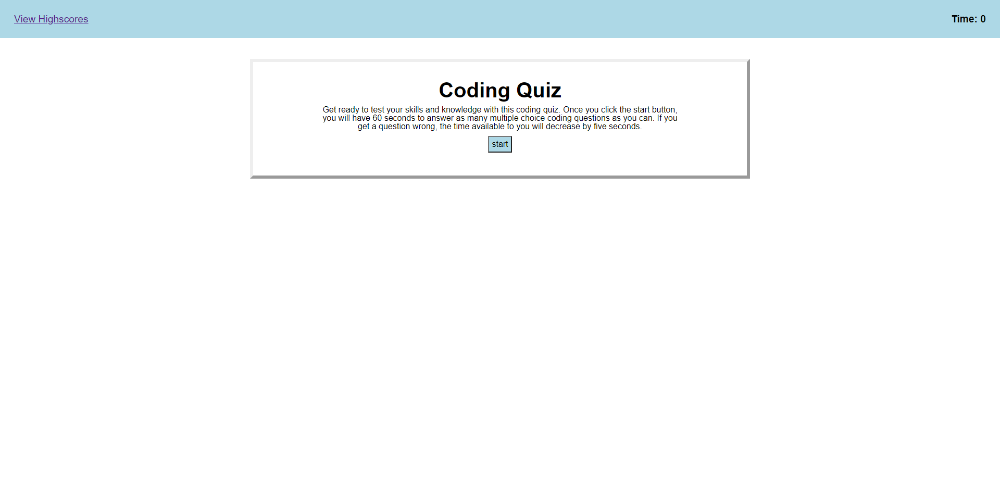

# code-quiz-2021
## Description
This project was the first largescale project in which I was able to fully utilize standard Web APIs. I learned alot about how javascript interacts with CSS styles and HTML elements as well as many unexpected errors in the ways we can connect the three. Planning was essential to mapping out the javascript logic. I can easily see myself getting lost in the code if I had not preplanned how everything would work together. In the end I made this fun quiz game that I hope to keep adding to in the future. Please enjoy yourselves. 
## Table of Contents
- [Installation](#installation)
- [Usage](#usage)
- [Credits](#credits)
- [License](#license)
## Installation
Deployed Link: https://randy-chou.github.io/code-quiz-2021/
## Usage
Webpage Screenshot:

## Credits
N/A
## License
N/A
## Badges
N/A
## Features
Click the start button to begin the game. A counter for 60 seconds will start counting down in the top right. You are able to answer buttons to increase your ending score, but each wrong answer reduces the remaining time by five seconds. Upon running out of time you can give your initials to locally store you score. The viewscore link on the top left can be used to view the scoreboard at any time, however doing so will reset the game.

Due to the limited amount of questions, the same question may be asked twice in a row which visually does not change the game panel except for the current question number.
## How to Contribute
Feel free to add more questions to the question array.
## Tests